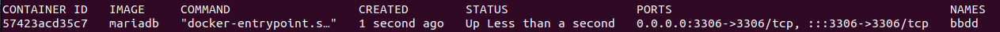
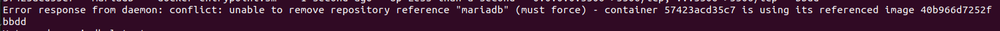
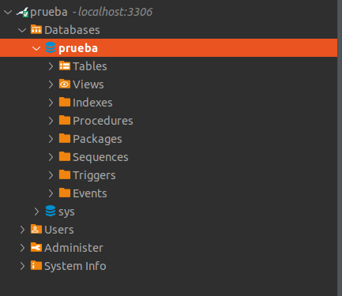

## SOLUCION RETO 2 ###

1. 

2. 

3. 

4. Ejecutando el script reto2.sh va a descargar la imagen, crear el contenedor, mostrar el contenedor corriendo, tratar de borrarlo mientras esta up, parar el contenedor y luego borrar imagen y contenedor.

